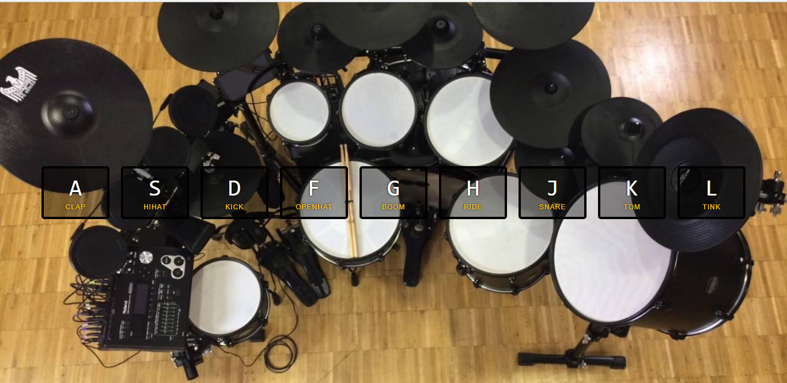

# JavaScript30 Challenge 01 - Interactive Drums
This simple website enables users to play drum sounds using 9 buttons on their keyboard.

## Lessons learned
Wes wastes no time and really throws viewers off the deep end with the first challenge. I expected something a bit more basic but this challenge is anything but.

I learned some good things about DOM manipulation,assigning classes to elements, transitions, key events and how you can manipulate them from JavaScript in CSS. I had to use some of the cool ES6 features i had picked up earlier, so far things aren't that difficult.

As a small customization, I changed the picture used by Wes into one with drums, to be more reflective of the actual content.
