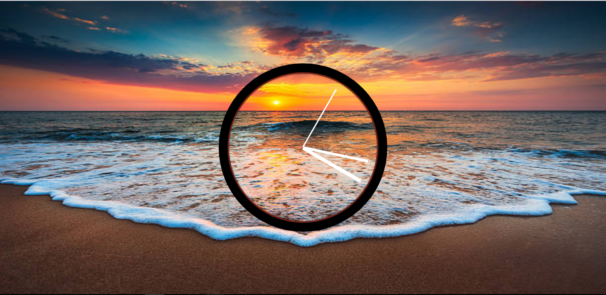

# JavaScript30 Challenge 02 - Analog clock
This simple website displays an analog clock over an elegant background.

## Lessons learned

Personally this exercise was very tough, from figuring out to use transition and how convert seconds, minutes and hours to degrees.

I typed most of the code following the example and I to create my own operations for getting the minutes and hour hands to move. But still had the challenge of converting the times gotten from javascript to degrees to enable the transitions.

I tried quite hard to figure out a solution to remove the small glitch related to the seconds hand when it reached the 12 o'clock position. But looking at the solution of others i figured had to reset the transition when it was at 90degrees and was able to solve that problem.

In terms of customization, I changed the picture used by Wes into one with a sunset i got from google. I also swapped the white outline of the clock and the black hands with colors that are visible in the image. 
