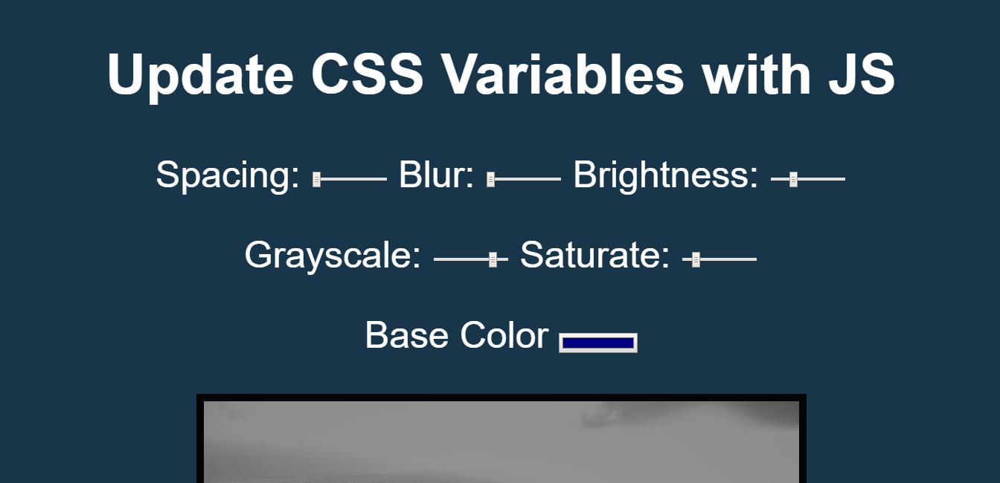

# JavaScript30 Challenge 02 - Updating CSS variables with JS
This simple website displays an analog clock over an elegant background.

## Lessons learned
learnt about css variables, datasets

datasets is an objects that would contain all the data attribute from a specific element

i also added some extra filters to the ones orignally added by wesbos.